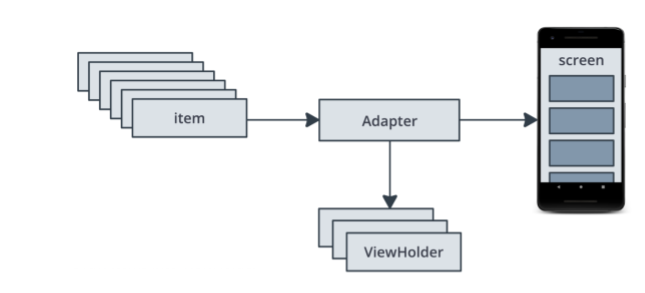

# Affirmations

RecyclerViewの仕組み

- RecyclerView ウィジェットを使用すると、データのリストを表示できます。
- RecyclerView は、アダプタ パターンを使用して、データの調整と表示を行います。
- ViewHolder は、RecyclerView のためにビューを作成して保持します。
- RecyclerView は、組み込みの LayoutManagers に付属しています。RecyclerView は、項目の配置を LayoutManagers に委譲します。

# 参照
- https://developer.android.com/codelabs/basic-android-kotlin-training-recyclerview-scrollable-list
- https://developer.android.com/codelabs/basic-android-kotlin-training-display-list-cards

